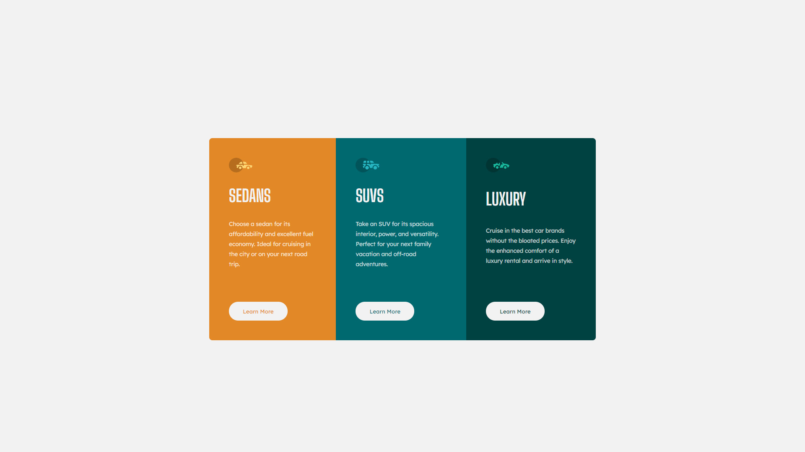

-   [Overview](#overview)
    -   [The challenge](#the-challenge)
    -   [Screenshot](#screenshot)
    -   [Links](#links)
-   [My process](#my-process)
    -   [Built with](#built-with)
    -   [What I learned](#what-i-learned)
    -   [Continued development](#continued-development)
    -   [Useful resources](#useful-resources)
-   [Author](#author)
-   [Acknowledgments](#acknowledgments)

## Overview

### The challenge

3-column preview card component

### Screenshot

### Links

-   Solution URL: [Github](https://github.com/mate966/3-column-card.git)
-   Live Site URL: [Github Pages](https://mate966.github.io/3-column-card/)

## My process

### Built with

-   Mobile-first workflow
-   RWD
-   Sass

### What I learned

I trained Sass and RWD.

### Continued development

Create more projects.

### Useful resources

-   [Stack Overflow] (https://stackoverflow.com/)
-   [Youtube - freeCodeCamp.org] (httpshttps://www.youtube.com/watch?v=_a5j7KoflTs&ab_channel=freeCodeCamp.orgstackoverflow.com/)

## Author

-   Frontend Mentor - [mate966](https://www.frontendmentor.io/profile/mate966)
-   Github - [mate966](https://github.com/mate966)

## Acknowledgments

-   Udemy [Samuraj Programowania](https://www.udemy.com/user/samuraj-programowania/)
